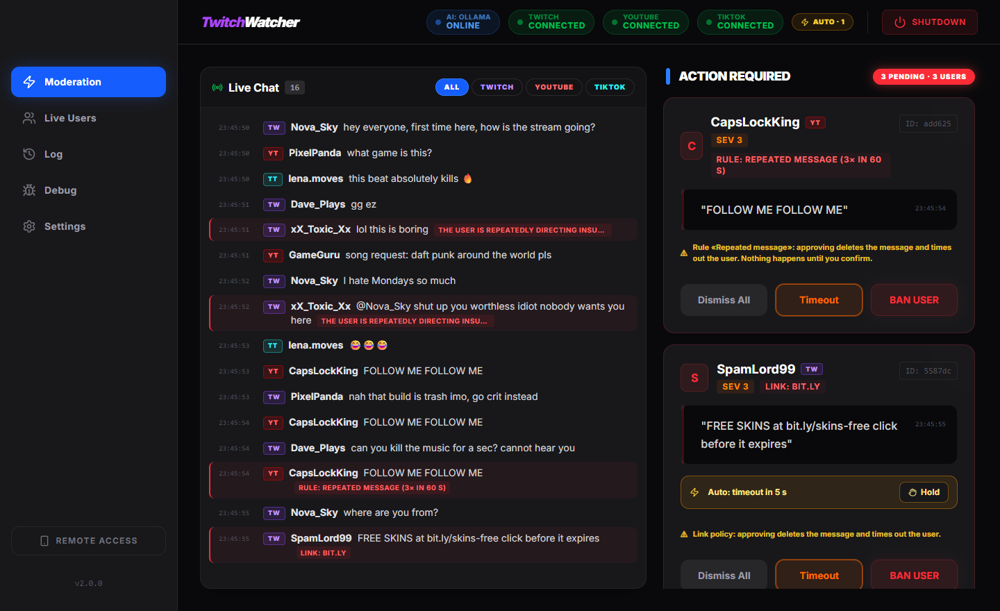
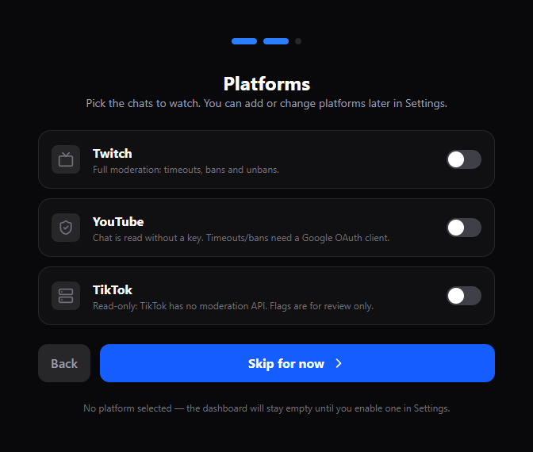
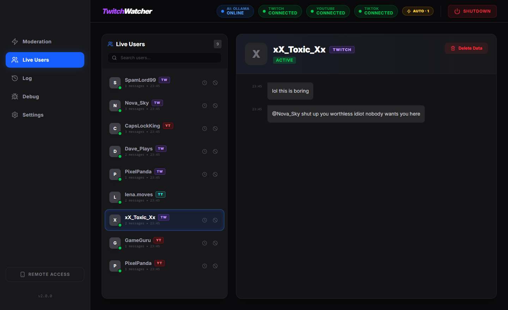

> [!NOTE] 
> This project was **Vibe Coded** (built with AI assistance).

> [!WARNING]
> **LIMITATIONS**: This application is running locally on your machine.
> *   **Rate Limits**: It cannot handle massive chat volumes (e.g., thousands of messages per second) due to Google AI API rate limits and local processing power.
> *   **AI Latency**: Local LLM inference (Ollama) depends on your GPU/CPU speed. High chat traffic may cause a backlog in processing.
> *   **Small models are imperfect**: `gemma3:4b` will occasionally over- or under-flag. The sensitivity setting, per-user notes and the flood breaker keep the queue usable; a bigger model (or Google Gemini) is noticeably more accurate.

# TwitchWatcher

**TwitchWatcher** is a local, AI-powered auto-moderation dashboard for live streamers on **Twitch, YouTube and TikTok**. It serves as an intelligent "second pair of eyes," watching all your chats in one merged feed and detecting toxicity, hate speech, threats and spam in real time.



Unlike traditional bots that ban instantly, TwitchWatcher **queues suspicious messages** for human review. This "Human-in-the-Loop" approach prevents AI hallucinations from causing unfair bans while keeping your community safe.

## Key Features
*   **Multi-platform**: Twitch, YouTube and TikTok chats merged into one live feed, each message tagged with its platform. Enable any combination.
*   **AI Moderation**: Supports **Ollama** (Local, Free) and **Google Gemini** (Cloud, Fast).
*   **Split-view Moderation tab**: live chat on the left, the AI's pending actions on the right. Flagged messages are highlighted inline; hover any message for a quick timeout/ban.
*   **Tunable, not trigger-happy**: sensitivity levels, category toggles, per-user *notes* for borderline messages, and a flood breaker that reacts when the AI starts flagging everything.
*   **Network Access**: Control the dashboard from your phone or tablet via local network (QR Code included).
*   **Privacy First**: All chat logs and user data are stored locally on your machine.

| Platform | Read chat | Timeout / Ban | What you need |
| :--- | :--- | :--- | :--- |
| **Twitch** | ✅ | ✅ | A Twitch application (Client ID + Secret) and a bot/mod account |
| **YouTube** | ✅ (no key needed) | ✅ | A Google Cloud OAuth client with the YouTube Data API v3 enabled |
| **TikTok** | ✅ (username only) | ❌ read-only | Nothing — TikTok has no public moderation API, so flags are for review only |

---

## 🚀 Installation & Setup

### Option 1: Easy Install (Recommended)

Use this if you just want to run the app without touching code.

1.  **Download** the release zip file: [TwitchWatcher.zip](https://github.com/Istalry/TwitchWatcher/releases/tag/Release).
2.  **Extract All** contents to a folder.
3.  **Run** `TwitchWatcher.exe`.
4.  **Configure**: the setup wizard opens in your browser. Pick the platforms you want (or skip and add them later in **Settings**), then choose your AI engine.

### Option 2: Developer Setup (From Source)
Use this if you want to modify the code.

1.  **Prerequisites**: [Node.js](https://nodejs.org/) **v20 or newer**.
2.  **Clone the Repository**
    ```bash
    git clone https://github.com/yourusername/TwitchWatcher.git
    cd TwitchWatcher
    ```
3.  **Run Setup**: Double-click `setup.bat` (pulls the Ollama model and installs dependencies).
4.  **Start App**: Double-click `start_app.bat` and open `http://localhost:5173`. The setup wizard asks for your credentials.

### 🔑 Getting API Keys

Everything is optional — enable only the platforms you stream on.

#### Twitch
1.  Go to the [Twitch Developer Console](https://dev.twitch.tv/console).
2.  Click **Register Your Application**.
3.  **Name**: TwitchWatcher (or anything you like).
4.  **OAuth Redirect URLs**: `http://localhost:3000/auth/twitch/callback`
5.  **Category**: Chat Bot.
6.  Create it, then copy your **Client ID** and **Client Secret**.

#### YouTube
Reading the chat needs nothing but your channel handle (e.g. `@yourchannel`). The app finds your current live stream automatically.
To **timeout/ban from the dashboard**, it needs a Google OAuth client:
1.  Open [Google Cloud Console → Credentials](https://console.cloud.google.com/apis/credentials) and create a project.
2.  **Enable the YouTube Data API v3** for that project.
3.  Create an **OAuth client ID** (type *Web application*) with the redirect URI `http://localhost:3000/auth/youtube/callback`.
4.  Copy the **Client ID** and **Client Secret**. After saving, click **Connect** to sign in with the Google account that moderates the channel.

#### TikTok
Just your TikTok username. The app connects whenever that account is LIVE. Optional: an [Euler Stream](https://www.eulerstream.com/) API key raises the free connection rate limit.

#### Google AI (Optional, for faster/better AI)
1.  Go to [Google AI Studio](https://aistudio.google.com/app/api-keys).
2.  Click **Create API Key**.
3.  Copy the key string (starts with `AIza...`).

---

## 🛡️ Security & API Keys

We take security seriously. Here is how your data is handled:

*   **Encrypted Storage**: Your sensitive credentials (API Keys, Client Secrets, OAuth tokens) are **encrypted** using **AES-256-GCM** before being written to disk. The decryption key is generated dynamically based on your specific machine, meaning the config file cannot be read if copied to another computer.
*   **Local Only**: Settings are stored in `settings.json` next to the executable (or in `server/` when running from source).
*   **Git Ignored**: This settings file is explicitly listed in `.gitignore`.
*   **Data Privacy**: Chat logs and user history are also stored in local JSON files. No data is sent to us.

> [!IMPORTANT]
> Never share your `settings.json` with anyone.

---

## 💡 How to Use

### The Moderation tab
*   **Live Chat** (left): every message from every enabled platform, newest at the bottom. Filter by platform with the chips. Messages the AI queued are highlighted in red with the reason. Hover a message for quick **Timeout** / **Ban** buttons (where the platform allows it).
*   **Action Required** (right): one card per flagged user. **Timeout** or **Ban** executes on the platform; **Dismiss** just clears the card. TikTok cards can only be dismissed — handle the user in the TikTok app.
*   On a phone the two panes become a **Chat | Queue** toggle.

### Live Users
Everyone who has chatted, across platforms. Click a user to see their history and any **AI notes** — borderline flags that stayed below your sensitivity threshold.


### Settings → Moderation
*   **Sensitivity**: *Lenient* / *Balanced* / *Strict* sets the severity a flag needs to become a card. Anything below becomes a note on the user instead. Explicit slurs and threats always reach the queue.
*   **Categories**: opt out of e.g. vulgarity or spam. Hate speech and threats are always on.
*   If the AI starts flagging more than half of chat, a **flood breaker** temporarily raises the threshold and shows a banner — a hint to lower the sensitivity or switch model.

### Mobile Access (QR Code)
Want to use your iPad or Phone as a moderation deck?
1.  Make sure your PC and Phone are on the same Wi-Fi.
2.  On the dashboard, look for the **Remote Access** button (bottom left).
3.  Scan the **QR Code**.
4.  You now have full control from your mobile device!

---

## 🛠️ Troubleshooting

*   **"App works but AI isn't flagging anything"**: Check the AI pill in the top bar — amber means the last analysis failed (hover for the error). Ensure Ollama is running and the model exists (`ollama pull gemma3:4b`), or that your Google AI key is valid.
*   **"The AI flags everything"**: Lower the sensitivity in Settings → Moderation, or use a larger model. The flood breaker will also kick in automatically.
*   **"Twitch Auth Failed"**: Double-check your Client ID and Secret, and ensure the Redirect URL in Twitch Console matches `http://localhost:3000/auth/twitch/callback`.
*   **"YouTube: Channel is not live"**: The app only attaches to an active live stream; it retries every minute. You can also paste a specific video ID in the YouTube settings.
*   **"TikTok: Not live"**: TikTok can only be watched while that account is streaming; the app retries every minute.
